<!-- ╔══════════════════════════════════════════════════════════════════════╗ -->
<!-- ║                        🌟 PROFILE README                          ║ -->
<!-- ║             Auto-generated metrics via lowlighter/metrics          ║ -->
<!-- ╚══════════════════════════════════════════════════════════════════════╝ -->

  <!-- Typing SVG Header -->
  

   

  <!-- Badges -->
  
  
  
  

    

  <!-- Metrics: Header Overview -->
  

---

## 🚀 About Me

I am a software developer passionate about building **end-to-end solutions** — from architecting robust databases and blazing-fast backends to crafting seamless frontend and mobile experiences.

Whether I am developing intelligent web applications, setting up reliable server infrastructures, or teaching code to the next generation of tech enthusiasts, I focus on **performance**, **clean architecture**, and **scalable design**.

<table>
  <tr>
    <td>💻</td>
    <td><strong>Full-Stack Web</strong></td>
    <td>Weaving complex logic into reality using the <strong>Next.js/React</strong> ecosystem and building solid, high-performance backends with <strong>Go</strong> and <strong>MongoDB</strong>.</td>
  </tr>
  <tr>
    <td>📱</td>
    <td><strong>Mobile Development</strong></td>
    <td>Turning ideas into beautiful, responsive, and cross-platform applications with <strong>Flutter</strong>.</td>
  </tr>
  <tr>
    <td>☁️</td>
    <td><strong>Infrastructure & DevOps</strong></td>
    <td>Structuring reliable server environments, containerizing applications with <strong>Docker</strong>, and streamlining deployments.</td>
  </tr>
  <tr>
    <td>🧑‍🏫</td>
    <td><strong>Mentoring & Community</strong></td>
    <td>Highly passionate about tech education, instructing others in programming, and contributing to the developer community.</td>
  </tr>
</table>

---

## 🛠️ Tech Stack & Toolbox

<!-- All-in-one skill icons from skillicons.dev -->

  
   
  
   
  

 

<!-- Detailed breakdown by category -->

  
<b>🌐 Frontend & Mobile — click to expand</b>

   
  

    
    
    
    
    
    
    
    
    
  

  
<b>⚙️ Backend & Database — click to expand</b>

   
  

    
    
    
    
    
    
    
    
  

  
<b>🛠️ DevOps & Tools — click to expand</b>

   
  

    
    
    
    
    
    
    
    
  

---

## 📊 GitHub Metrics

<!-- Generated automatically by lowlighter/metrics GitHub Action -->

  <!-- Isometric Contribution Calendar -->
  

   

  <!-- Languages -->
  
  

   

  <!-- Achievements -->
  

   

  <!-- Recently Starred -->
  

---

## 🧬 My Development Pipeline

How I transform ideas into production-ready systems:

```mermaid
graph LR
    A["🎨 Design & UI"] --> B["📱 Flutter / Next.js"]
    B --> C["⚡ Go / REST API"]
    C --> D["🐳 Docker Container"]
    D --> E["🔄 CI/CD Pipeline"]
    E --> F["🚀 Stable Infrastructure"]

    style A fill:#6C63FF,stroke:#4a42d4,stroke-width:2px,color:#fff
    style B fill:#02569B,stroke:#014a82,stroke-width:2px,color:#fff
    style C fill:#00ADD8,stroke:#0090b3,stroke-width:2px,color:#fff
    style D fill:#2496ED,stroke:#1a7ac7,stroke-width:2px,color:#fff
    style E fill:#2088FF,stroke:#1a6dd4,stroke-width:2px,color:#fff
    style F fill:#00C853,stroke:#00a344,stroke-width:2px,color:#fff
```

---

## 📈 GitHub Stats

  
  

---

## 🌐 Connect With Me

  
  <!-- Add more social links below as needed -->
  <!--
  
  
  -->

---

  

  🤖 This README is auto-updated with <a href="https://github.com/lowlighter/metrics">lowlighter/metrics</a> via GitHub Actions

# kyl464
