  <!-- Social Badges -->
  &nbsp;
  &nbsp;
  &nbsp;
  

---

## Hi there 👋, < devs />

  

 

  My name is <strong>Luvky Pratama Johanes</strong>. A passionate developer from Indonesia. My main areas of interest are <strong>full-stack web development</strong> and <strong>cross-platform mobile apps</strong>. I architect robust backends with <strong>Go</strong>, build seamless frontends with <strong>Next.js/React</strong>, and craft beautiful mobile experiences with <strong>Flutter</strong>. Beyond coding, I'm passionate about <strong>DevOps</strong>, <strong>mentoring</strong>, and contributing to the developer community.

---

## 🛠️ Tech Stack

  
   
  
   
  

---

## 📊 Statistics

   

  
  &nbsp;&nbsp;
  

  

  

  

  

---

## 🧬 Development Pipeline

How I transform ideas into production-ready systems:

```mermaid
graph LR
    A["🎨 Design & UI"] --> B["📱 Flutter / Next.js"]
    B --> C["⚡ Go / REST API"]
    C --> D["🐳 Docker Container"]
    D --> E["🔄 CI/CD Pipeline"]
    E --> F["🚀 Production"]

    style A fill:#6C63FF,stroke:#4a42d4,stroke-width:2px,color:#fff
    style B fill:#02569B,stroke:#014a82,stroke-width:2px,color:#fff
    style C fill:#00ADD8,stroke:#0090b3,stroke-width:2px,color:#fff
    style D fill:#2496ED,stroke:#1a7ac7,stroke-width:2px,color:#fff
    style E fill:#2088FF,stroke:#1a6dd4,stroke-width:2px,color:#fff
    style F fill:#00C853,stroke:#00a344,stroke-width:2px,color:#fff
```

---

  

Made with ❤️ by Luvky Pratama Johanes

